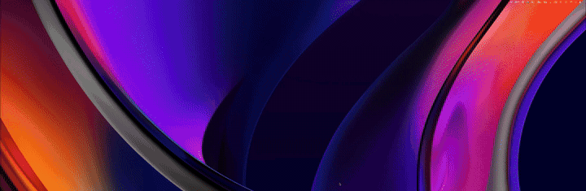

# Shade

A drop-down terminal for macOS in the spirit of [Guake] / [Yakuake] on Linux —
hidden by default, slides down from the top of the screen on a global hotkey,
disappears just as fast. Tabs, transparency, keyboard-first.

Native Swift / SwiftUI. Status-bar app (no Dock icon). MIT licensed.



[Guake]: http://guake-project.org/
[Yakuake]: https://apps.kde.org/yakuake/

---

## Features

- **Global hotkey** to toggle the panel (default `F12`, rebind in Settings).
- **Slides** down from the top of the active screen, fades back up.
- **Tabs** with `⌘T` / `⌘W` / `⌘1…9` / `⌃Tab` (macOS-standard).
- **Saved SSH connections** — keep named servers or `~/.ssh/config` aliases in
  Settings, open the searchable picker with `⌘⇧P`, or connect directly to
  the first nine profiles with `⌘⇧1…9`.
- **Tab titles** track the shell's current working directory (no `.zshrc`
  cooperation required), or double-click a tab to pin your own name.
- **Tab status dots** — a red dot when a tab's last command exited non-zero
  (needs the OSC 133 snippet), a neutral dot when a background tab has new
  output you haven't seen.
- **Multi-monitor** aware — appears on the screen containing the mouse, or on
  the primary screen, your choice.
- **Customizable layout** — width, height, horizontal alignment, screen
  selection, font family/size, background opacity, background blur,
  slide-animation duration.
- **Live-apply** settings — most preferences take effect immediately; layout
  ones (size/position) on the next toggle.
- **Prompt pinned to bottom** of the panel (Guake-style), regardless of the
  panel's height.
- **Layout-agnostic shortcuts** — Control+letter shortcuts (`⌃R`, `⌃A`, `⌃E`,
  `⌃W`, …) work correctly on Cyrillic / Greek / non-Latin keyboard layouts.
- **Git badge** — floating pill in the top-right of the terminal shows the
  current branch plus `±N` files, `+X` insertions, `-Y` deletions when the
  working tree is dirty. Hidden outside git repos. Updates on `cd` and
  `git checkout` within ~1 second. Automatically hidden while you're inside
  an `ssh` / `mosh` session (the local heuristics no longer describe what
  you're seeing); the tab title becomes `[ssh]` until you `exit`.
- **Clickable links** — `⌘`-hover highlights URLs in the buffer, `⌘`-click
  opens them. URLs go through `NSWorkspace.shared.open`; absolute or
  relative file paths are revealed in Finder instead of being launched in
  the default app.
- **Drag-and-drop** — drop a file from Finder onto the terminal and its
  shell-quoted path is inserted at the cursor.
- **Prompt-mark navigation (OSC 133)** — jump between previous / next shell
  prompts with `⌘⇧↑` / `⌘⇧↓`, copy the previous command's output with
  `⌘⇧O`. Opt-in via a short shell-side snippet (see "Recommended shell
  setup"); without it Shade behaves identically to before.
- **Richer completion inside Shade (opt-in)** — for a bare zsh, a Settings
  toggle turns on tab-completion (`git`, `make`, `ssh`, …) plus the OSC 133
  marks by pointing the shell at a bundled `ZDOTDIR` — without editing your
  dotfiles and without overriding a config you've already tuned (oh-my-zsh, …).
  zsh only; off by default (Settings → Terminal → Shell Integration). See
  "Recommended shell setup".
- **Command-finished notifications** — opt-in: a command that runs past a
  threshold and finishes while the panel is hidden posts a native notification
  (needs the OSC 133 snippet). Enable in Settings → Notifications.
- **Hide on focus loss** — optional: the panel slides away when you switch to
  another app (Settings → General → Behavior). Off by default.
- **New tab in the current directory** — optional: `⌘T` opens in the active
  tab's directory instead of `~` (Settings → General → Behavior). Off by default.
- **Cursor & bell** — choose the cursor shape (block / bar / underline) and
  blink, plus an optional visual bell (screen flash), in Settings → Terminal.
- **Open at Login** toggle.

---

## Install

### Homebrew (recommended)

```sh
brew tap tavvet/tap
brew install --cask shade
```

Tap source: [tavvet/homebrew-tap](https://github.com/tavvet/homebrew-tap).

### Download .dmg

Grab `Shade.dmg` from the
[latest GitHub release](https://github.com/tavvet/shade/releases/latest),
open it, drag `Shade.app` into your `Applications` folder.

**First launch needs one extra step** while the project doesn't have an
Apple Developer ID. macOS Gatekeeper will refuse a normal double-click
with *"Apple could not verify Shade is free of malware…"* —
**right-click `Shade.app` → Open → Open** once, and macOS will
remember the decision forever. (Alternative: `xattr -d com.apple.quarantine
/Applications/Shade.app` from any terminal.) Notarized builds will follow
in a later release and remove this step.

Once Shade is running you'll see a `▾` icon in the menu bar. Press
`F12` (the default toggle hotkey — rebindable in Settings) and the
drop-down terminal slides in from the top of the screen.

To start on login: open `Settings…` from the menu-bar icon and flip
**Open at Login**.

### Build from source

```sh
git clone https://github.com/tavvet/shade.git
cd shade
make            # produces build/Shade.app
make run        # build + launch
swift test      # unit tests
```

Requirements: macOS 13+ and Xcode 16+ (Swift 6 toolchain). The build
ad-hoc codesigns the bundle so the OS can prompt cleanly for any future
entitlements / permissions. To sign with a real Developer ID for
distribution: `DEVELOPER_ID="Developer ID Application: Name (TEAMID)"
make build`.

Move it where you want it:

```sh
cp -R build/Shade.app /Applications/
open /Applications/Shade.app
# if "Open at Login" was on, toggle it off and on so the new path is registered
```

---

## Usage

### Toggle the panel

Default hotkey: **`F12`**.

> Note: on a stock Mac, the function-key row is mapped to media keys, so you
> may need to press `Fn+F12`. To make `F12` work standalone, enable
> *System Settings → Keyboard → Use F1, F2, etc. keys as standard function
> keys*, or just rebind in Shade's Settings to something like `Ctrl+\``.

Press `Esc` (or `F12` again) to hide.

### Tabs

| Action            | Shortcut           |
|-------------------|--------------------|
| New tab           | `⌘T`               |
| Close active tab  | `⌘W`               |
| Jump to tab N     | `⌘1` … `⌘9`        |
| Next tab          | `⌃Tab`             |
| Previous tab      | `⌃⇧Tab`            |

The tab bar lives at the bottom of the panel. Click a chip to switch, click
the `×` to close, click `+` for a new tab. Tab labels show the index and the
abbreviated current working directory (e.g. `1 · ~/projects/shade`).
Double-click a tab (or right-click → Rename) to pin a fixed name instead; an
empty name or Reset Name restores the automatic title.

Closing the last tab opens a fresh one. If that replacement shell exits before
receiving user input (for example because `$SHELL` is invalid or a startup file
calls `exit`), Shade stops the automatic restart loop and leaves recovery
instructions in the terminal.

### Other shortcuts

| Action               | Shortcut    |
|----------------------|-------------|
| Toggle panel         | `F12`       |
| Hide panel           | `Esc`       |
| Copy / Paste         | `⌘C` / `⌘V` |
| Cut                  | `⌘X` — copies the selection and sends N backspaces into the shell. Works cleanly when the selection runs from the cursor backward (e.g. `⌥⇧←` + `⌘X` cuts the last word); mid-line or multi-line selections delete N chars from the cursor instead of from the highlighted region — readline can't be repositioned from outside. Use `⌃W` / `⌃U` / `⌃K` for precise input editing. |
| Select all           | `⌘A`        |
| Clear screen         | `⌘K` (Guake-style — prompt lands at the bottom, unlike the builtin `clear` which leaves it at the top) |
| Font size            | `⌘+` / `⌘−` to zoom in / out, `⌘0` to reset (8–32 pt, persisted) |
| Delete word back     | `⌥⌫` (readline `backward-kill-word`) |
| Beginning / end of line | `Home` / `End` (translated to `⌃A` / `⌃E` so they work regardless of shell config) |
| Page up / down       | `PageUp` / `PageDown` are sent to the running program, so full-screen apps (`nano`, `less`, …) page their own view; scrollback is on the trackpad / scroll wheel |
| Extend selection (char) | `⇧←` / `⇧→` / `⇧↑` / `⇧↓` |
| Extend selection (word) | `⌥⇧←` / `⌥⇧→` |
| Extend selection (line edge) | `⌘⇧←` / `⌘⇧→` |
| Jump to previous / next prompt | `⌘⇧↑` / `⌘⇧↓` (requires OSC 133 shell integration — see below) |
| Copy previous command's output | `⌘⇧O` (requires OSC 133 shell integration — see below) |
| Open connection picker | `⌘⇧P` |
| Connect saved profile N | `⌘⇧1` … `⌘⇧9` |
| Open link / file     | `⌘`-click (URLs go to the default browser, file paths reveal in Finder) |
| Open Settings        | `⌘,`        |
| Quit Shade           | `⌘Q`        |

`⌃R`, `⌃A`, `⌃E`, `⌃W`, `⌃U`, `⌃K`, … are all forwarded to the shell
unchanged — they work even when your keyboard layout is non-Latin
(Cyrillic, Greek, etc.).

---

## Configuration

### Via the Settings window

Open Settings from the menu-bar `▾` icon. The sidebar groups preferences into
six focused pages:

- **General** — panel size and position, focus behavior, new-tab directory,
  Open at Login and slide animation
- **Connections** — saved SSH profiles and their quick-access order
- **Appearance** — monospace font family and size, background opacity, link
  highlight color, blur and material
- **Terminal** — zsh completion enrichment, cursor shape and blink, visual bell
- **Notifications** — command-finished alerts and their duration threshold
- **Shortcuts** — global-hotkey recorder and keyboard reference

Changes that affect the visible panel apply immediately; size/position changes
apply on the next toggle.

### Via `defaults` (CLI)

The Settings window is the easy path; for headless / dotfiles use the same
keys via `defaults`. Shade reloads them whenever the panel opens: layout and
appearance changes reach the running tabs, `shellEnrichment` applies to newly
launched shells, and `newTabInheritsCwd` applies to subsequently created tabs.
Enabling command notifications this way asks for macOS permission the next time
the panel is shown.

```sh
# Layout
defaults write dev.shade.Shade widthFraction 0.6
defaults write dev.shade.Shade heightFraction 0.45
defaults write dev.shade.Shade horizontalAlignment center      # left | center | right
defaults write dev.shade.Shade screenChoice mouseLocation      # main | mouseLocation

# Appearance
defaults write dev.shade.Shade fontSize 14
defaults write dev.shade.Shade fontName "Menlo"                # "" = system monospaced
defaults write dev.shade.Shade backgroundOpacity 0.85          # 0.3 – 1.0
defaults write dev.shade.Shade backgroundBlur -bool true       # frosted backdrop (most visible at lower opacity)
defaults write dev.shade.Shade blurMaterial hud                # hud | underWindow | sidebar | fullScreen
defaults write dev.shade.Shade cursorShape block               # block | bar | underline
defaults write dev.shade.Shade cursorBlink -bool false

# Animation
defaults write dev.shade.Shade animationDuration 0.12          # 0.0 – 0.5 seconds

# Behavior
defaults write dev.shade.Shade hideOnFocusLoss -bool true      # hide when Shade loses focus
defaults write dev.shade.Shade newTabInheritsCwd -bool true    # ⌘T opens in the current directory
defaults write dev.shade.Shade visualBell -bool true           # flash on the terminal bell
defaults write dev.shade.Shade shellEnrichment -bool true      # richer zsh completion inside Shade (zsh only)

# Notifications (command finished while panel hidden; needs OSC 133)
defaults write dev.shade.Shade notifyOnCommandFinish -bool true
defaults write dev.shade.Shade notifyThresholdSeconds 30        # min command duration, seconds

# Link highlight color (Cmd-hover underline + cell tint). 6-char hex, no '#'.
defaults write dev.shade.Shade linkHighlightHex "00CCFF"       # default: FFCC00

# Inspect / reset
defaults read dev.shade.Shade
defaults delete dev.shade.Shade
```

Hotkeys are stored separately by the KeyboardShortcuts library; rebind via
the Settings window.

---

## Saved SSH connections

Open **Settings → Connections** to add a server. A profile has a display name
and host (or an alias from `~/.ssh/config`), plus optional username, port and
identity-file overrides. Shade uses the system `/usr/bin/ssh` client, so
ProxyJump, forwarding, keepalive and other advanced behavior stays in your
normal SSH config. Passwords, passphrases and private-key contents are never
stored by Shade.

With the terminal panel open:

- press `⌘⇧P` to search saved profiles by name, host, user, port or key path;
- use `↑` / `↓` to select, `Return` to connect and `Esc` to close the picker;
- press `⌘⇧1`…`⌘⇧9` to connect to the corresponding profile directly;
- reorder profiles in Settings to choose which server occupies each quick slot.

Each connection opens in a new tab pinned to the profile's display name. When
SSH exits, the same tab continues as a local login shell. Profile fields are
passed to OpenSSH as structured arguments rather than interpolated into a shell
command, and SSH inherits the app environment so an available `SSH_AUTH_SOCK`
continues to work.

Profiles are stored as a versioned JSON file at
`~/Library/Application Support/Shade/connections.json`. Shade creates it with
user-only (`0600`) permissions and writes updates atomically. If the file is
unreadable, malformed or from an unsupported newer format, Shade blocks edits
instead of overwriting it; repair or restore the file, then click **Retry**.
Removing a profile does not modify `~/.ssh/config` or delete any key files.

---

## Releases

See [CHANGELOG.md](./CHANGELOG.md) for release notes.

## Recommended shell setup

Shade is a *terminal*, not a *shell* — the command line itself (completion,
ghost auto-suggestions, reverse history search, key bindings) is your shell's
job, and Shade renders it rather than replacing it. Shade deliberately does
**not** grow a Warp-style as-you-type completion dropdown: that would mean owning
the input line and discarding your `zle`, vi-mode and key bindings — a different
product. Two opt-ins make the out-of-the-box experience nicer without giving that
up.

### Richer completion inside Shade (opt-in)

If your zsh is bare — no `compinit`, no framework — turn on **Settings →
Terminal → Shell Integration → "Enrich completion inside Shade"** (or
`defaults write dev.shade.Shade
shellEnrichment -bool true`). Shade then launches zsh with `ZDOTDIR` pointed at a
bundled shim that:

- loads your real `~/.zshrc` first, so your `PATH`, aliases, prompt and key
  bindings win, while respecting a custom `ZDOTDIR` and changes made by earlier
  zsh startup files;
- runs `compinit` **only if you haven't already**, lighting up the tab-completion
  for `git`, `make`, `ssh`, … that already ships with zsh; and
- enables the OSC 133 prompt marks, so `⌘⇧↑` / `⌘⇧↓` / `⌘⇧O` work without the
  manual snippet below.

It never edits your dotfiles, only affects shells Shade spawns, and no-ops if you
already set up completion (oh-my-zsh, prezto, …). zsh only — bash and fish keep
the manual snippet. Off by default.

### Shell-side extras

Ghost suggestions, syntax highlighting and fuzzy history live entirely in your
shell. A sensible baseline for zsh:

```sh
# Ghost suggestions (greyed-out completion of past commands, right-arrow to accept)
brew install zsh-autosuggestions
echo 'source /opt/homebrew/share/zsh-autosuggestions/zsh-autosuggestions.zsh' >> ~/.zshrc

# Syntax highlighting (commands turn red if not on PATH, etc.)
brew install zsh-syntax-highlighting
echo 'source /opt/homebrew/share/zsh-syntax-highlighting/zsh-syntax-highlighting.zsh' >> ~/.zshrc

# Fuzzy history search (Ctrl-R powerhouse replacement)
brew install fzf
$(brew --prefix)/opt/fzf/install
```

For dynamic tab titles to react instantly on `cd` (instead of waiting on
Shade's 1-second poll), you can also add:

```sh
# In ~/.zshrc — emits OSC 7 + OSC 0 on every prompt
precmd() { print -Pn "\e]7;file://${HOST}${PWD}\a\e]0;%~\a" }
```

To make the shell builtin `clear` behave like Shade's `⌘K` (prompt at the
bottom instead of the top), override it:

```sh
# In ~/.zshrc — clears screen and parks the cursor on the last row
clear() { printf '\e[2J\e[%d;1H' "$LINES" }
```

### Prompt marking (OSC 133)

Enables Shade's prompt-mark navigation (`⌘⇧↑` / `⌘⇧↓`) and "copy previous
command's output" (`⌘⇧O`). The shell emits invisible OSC 133 sequences
around each prompt (`A` = prompt start, `C` = command output begins,
`D;<exit>` = command finished); Shade records the positions and lets you
jump between them. Terminals that don't understand the sequences ignore
them, so the snippets are safe to leave on everywhere. (The **Shell** toggle
above already enables this for zsh — these snippets are for bash / fish, or for
using the marks without the toggle.)

Shade ships ready-to-source files for zsh, bash, and fish in
[`integrations/`](./integrations); the build copies them into
`Shade.app/Contents/Resources/integrations/` so they ride with each
Homebrew release. Add one line to your shell rc:

```sh
# ~/.zshrc — Homebrew install (Cask drops Shade.app in /Applications)
source "/Applications/Shade.app/Contents/Resources/integrations/shade.zsh"
# or from a source checkout
source /path/to/shade/integrations/shade.zsh
```

```sh
# ~/.bashrc — after sourcing bash-preexec.sh
# (see https://github.com/rcaloras/bash-preexec)
source "/Applications/Shade.app/Contents/Resources/integrations/shade.bash"
```

```fish
# ~/.config/fish/config.fish
source /Applications/Shade.app/Contents/Resources/integrations/shade.fish
```

If `⌘⇧↑` / `⌘⇧↓` does nothing, the shell isn't emitting marks yet — quickly
check by running `printf '\e]133;A\a'` a few times between commands and
trying the shortcut. Note that the shortcuts only have a visible effect
when there's scrollback to scroll into.

---

## Troubleshooting

**"Apple could not verify Shade is free of malware…"** Pre-notarization
builds are ad-hoc signed. Right-click `Shade.app` → **Open** → **Open** —
macOS will remember the decision for future launches. Or, in a terminal:
`xattr -d com.apple.quarantine /Applications/Shade.app`.

**`F12` does nothing.** macOS may be intercepting it as a media key. Either
press `Fn+F12`, flip *System Settings → Keyboard → Use F1, F2, etc. keys as
standard function keys*, or rebind to e.g. `Ctrl+\`` in Shade's Settings.

**Hotkey works once, then stops after moving the app.** SMAppService
remembers the absolute path of the bundle that registered itself. If you
moved `Shade.app` (e.g. into `/Applications`), toggle *Open at Login* off
and on again to re-register.

**Prompt appears in the middle of the panel, not the bottom.** The terminal
view computes its row count after layout. Shade primes the panel frame at
launch and resolves layout before the shell starts — if you ever see this,
file an issue with the screen geometry and font size.

**Ctrl+R does nothing on a non-Latin layout.** Shade re-implements
control-letter shortcuts using the physical keyCode rather than the
characters produced by the current input source. If a particular shortcut
still misbehaves, check `KeyCodes.swift` — the ANSI map covers letter rows
A–Z by default; non-letter rows are forwarded to SwiftTerm unmodified.

**New tabs open in `/` instead of `~`.** GUI apps launched via
LaunchServices start with `cwd = /`. Shade `chdir`s to `$HOME` at launch so
spawned shells inherit it — if you still see `/`, you launched the
executable directly (e.g. for debugging) rather than via the `.app` bundle.

**Tab title and git badge show wrong info during an SSH session.** This is
expected — Shade detects `ssh` / `mosh` / `tmate` in the terminal's foreground
process group and hides the local-only readouts (the tab title shows `[ssh]`
unless you've pinned a name, and the git badge disappears). Tabs opened from a
saved connection are pinned to the profile name automatically. Local cwd / git
state can't describe a remote machine. Remote OSC 7 updates are intentionally
masked as well; pin a custom tab name if you want a host-specific label while
the remote session is active.

**A saved SSH connection fails or ignores an expected option.** Shade invokes
the system `/usr/bin/ssh` and explicit profile fields override the matching
destination, user, port and identity-file arguments. Check the same host or
`~/.ssh/config` alias with `/usr/bin/ssh` in a regular terminal, verify key-file
permissions, and confirm your agent is available through `SSH_AUTH_SOCK`.

**Connections cannot be edited after a load error.** Shade deliberately leaves
an unreadable, malformed or newer `connections.json` untouched. Repair, replace
or move the file at `~/Library/Application Support/Shade/connections.json`, then
click **Retry** in Settings or the connection picker. Successful edits remain
blocked until the library loads again, preventing accidental data loss.

**Settings won't open / "About Shade" crashes / color picker doesn't
appear.** Make sure you're running the bundled `.app` and not the raw
executable — several features rely on `NSApp.applicationIconImage` and on
the bundle's `Info.plist`. Run via `make run` or `open
build/Shade.app`.

---

## Architecture

```
Sources/Shade/
├── ShadeApp.swift           @main + AppDelegate lifecycle coordination
├── ApplicationMenuController.swift  Main menu + menu-bar status item
├── AboutWindow.swift        About window — version, links, donation addresses
├── BranchBadge.swift        Floating git branch + status pill (SwiftUI)
├── CommandNotifier.swift    Command-finished notifications (OSC 133 C→D timing)
├── CommandNotificationCoordinator.swift  Completion-event notification policy/wiring
├── ConnectionsSettingsView.swift  Saved SSH connection list and ordering controls
├── DiagnosticsWindow.swift  Read-only state snapshot, copy-paste for bug reports
├── DropdownPanel.swift      NSPanel lifecycle, slide animation and event dispatch
├── GitInfo.swift            Git working-tree status aggregation and parsing
├── GitProcessRunner.swift   Cancellation-aware asynchronous Git subprocesses
├── GitRefreshCoordinator.swift  Event-driven, debounced git-status scheduler
├── GitRepository.swift      Filesystem-only repository discovery and HEAD reading
├── Hotkeys.swift            KeyboardShortcuts.Name declarations (toggleShade)
├── KeyCodes.swift           Layout-agnostic keyCode → ASCII mapping
├── PanelInputRouting.swift  Responder-chain guard + panel input contract
├── PanelKeyboardController.swift  Panel shortcuts, terminal input forwarding, cut/clear
├── PanelTerminalInputResolver.swift  Pure physical-key → terminal input translation
├── Preferences.swift        Settings value model + appearance/layout projections
├── PreferencesStore.swift   UserDefaults keys, validation, loading and persistence
├── ProcessCwd.swift         libproc-based CWD lookup for shell processes
├── ProcessTree.swift        Finds foreground ssh/mosh clients in the shell's process tree
├── PromptMarks.swift        OSC 133 prompt-mark parsing + jump/copy helpers
├── AppearanceSettingsView.swift  Appearance settings form
├── GeneralSettingsView.swift  Window, startup and behavior settings form
├── NotificationSettingsView.swift  Command-notification settings form
├── OSC133StreamObserver.swift  Non-invasive OSC 133 observation in the PTY stream
├── SettingsModel.swift      Observable settings snapshot + live-apply coordination
├── SettingsSystemServices.swift  Login-item and notification authorization adapters
├── SettingsView.swift       Settings sidebar navigation and page switching
├── SettingsWindow.swift     Settings NSWindowController
├── ShortcutsSettingsView.swift  Global hotkey and keyboard reference form
├── ProcessInvocation.swift  Structured executable and argument boundaries
├── TerminalSettingsView.swift  Shell, cursor and feedback settings form
├── ShellIntegration.swift   Opt-in ZDOTDIR injection — richer zsh completion + OSC 133
├── SSHCommandBuilder.swift  Validated OpenSSH invocation construction
├── SSHConnectionLaunch.swift  SSH profile → generic terminal launch configuration
├── SSHConnectionPickerComponents.swift  Quick-picker rows and supporting states
├── SSHConnectionPickerSearch.swift  Tokenized saved-connection filtering
├── SSHConnectionPickerView.swift  Searchable keyboard-first connection picker
├── SSHConnectionPickerWindow.swift  Lazy child-panel presentation and focus routing
├── SSHConnectionsController.swift  Shared connection library state and actions
├── SSHProfile.swift         Saved SSH profile model and validation
├── SSHProfileEditor.swift   Add/edit connection sheet and draft parsing
├── SSHProfileStore.swift    Private versioned JSON persistence
├── TabBar.swift             Tab-strip layout, scrolling and new-tab action
├── TabChip.swift            Individual tab rendering and inline rename state
├── TabsObservable.swift     Observable tab/session projection for SwiftUI
├── TerminalAppearance.swift  SwiftTerm styling and visual-bell rendering
├── TerminalBufferGeometry.swift  Public-API-only active-buffer geometry
├── TerminalCommandSequence.swift  One-PTY command → login-shell wrapper
├── TerminalContextPoller.swift  Visibility-scoped repeating context refresh
├── TerminalContextTracker.swift  CWD, Git status/branch and remote-session masking
├── TerminalKeyboardSelection.swift  Keyboard-driven buffer selection
├── TerminalLinkOpener.swift  Testable link/path resolution + system opening
├── TerminalLaunchConfiguration.swift  Generic startup directory/title/command descriptor
├── TerminalPresentationState.swift  Tab titles, activity and command-status state
├── TerminalProcessController.swift  SwiftTerm view, shell lifecycle and callback wiring
├── TerminalPromptHistory.swift  OSC 133 state, command timing, prompt navigation/output
├── TerminalPanelContentController.swift  Panel view hierarchy, tabs, badge and blur
├── TerminalSession.swift    Coordinator for one terminal tab
├── TerminalTabStore.swift   Pure multi-tab collection and selection state
├── TerminalViewAdapters.swift   SwiftTerm delegate proxy + activity/drop-enabled view
├── TerminalViewHost.swift   Active terminal view hosting, constraints and focus
└── TerminalsController.swift Coordinates multi-tab session lifecycle and side effects
```

Key design choices:

- **SwiftPM, not Xcode project.** Sources, `Package.swift`, `Resources/Info.plist`,
  and a small `Makefile` package everything into a bundle. Source-only,
  plain text, easy to grep / diff.
- **Borderless `NSPanel`**, no `.nonactivatingPanel`. The app activates fully
  when the panel is shown so that `⌘`-shortcuts route to us instead of
  leaking to whichever browser was last focused.
- **`performKeyEquivalent` + `sendEvent` override** in `DropdownPanel`.
  Both paths route Shade shortcuts before the responder chain; `sendEvent` is
  also the fallback for modified navigation keys and delegates terminal-specific
  translation to `PanelTerminalInputResolver`. The resolvers use physical key
  codes, so Control combinations and app shortcuts work independently of input
  layout.
- **Live-apply prefs.** `SettingsModel` publishes one `Preferences` snapshot.
  Edits are persisted immediately and `.shadePreferencesChanged` is posted after
  a short debounce; the application coordinator then updates panel content and
  every session so font/opacity changes remain instant.
- **Structured initial processes.** Saved connection values remain executable
  arguments all the way to `/usr/bin/ssh`; a single PTY-owning wrapper runs the
  initial process and then becomes the local login shell. Closing the tab
  terminates the wrapper's process group so it cannot start that fallback shell.
- **Prime-then-start.** The panel's frame is set off-screen at launch and
  layout is resolved before the first shell starts, so SwiftTerm knows its
  row count and `padCursorToBottom()` pins the prompt to the bottom of the
  panel from the very first prompt.

---

## Dependencies

- [SwiftTerm](https://github.com/migueldeicaza/SwiftTerm) — VT100 / xterm
  terminal emulator + local PTY shell hosting. Shade depends on a
  [rebase-tracked fork](https://github.com/tavvet/SwiftTerm), pinned by
  revision. The fork carries one local patch: configurable link-highlight
  color and cell tint. Keyboard selection, cut and OSC 133 tracking live in
  Shade and use SwiftTerm's public APIs or the open PTY view. Syncing upstream
  requires a patch re-audit before bumping the pin — see
  [docs/swiftterm-fork-migration.md](./docs/swiftterm-fork-migration.md).
- [KeyboardShortcuts](https://github.com/sindresorhus/KeyboardShortcuts) —
  global hotkey registration with a SwiftUI recorder UI.

Both are pinned via Swift Package Manager (`Package.swift`) and both are MIT
licensed, the same as Shade. Full license texts: [THIRDPARTY.md](./THIRDPARTY.md).

---

## Support

Shade is and will stay MIT-licensed. If it saves you time and you want to
chip in, USDT works on either chain — pick whichever has lower fees for
you:

- **USDT (BEP-20, BNB Smart Chain):** `0x9fbaa332ef68433d17c350d085bc5a4b404ec495`
- **USDT (TRC-20, TRON):** `TT8jU9Tbw5iLrNANTnCZgFCnCp6ZhAe2xm`
- **USDT (SPL, Solana):** `4sGwS8KgVanzCUeMNnWXBHwxv6voCKY7TmPkWRhdt2pR`

Strictly optional, no obligation either way.

## License

[MIT](./LICENSE) — © 2026 Anton Rudakov.

Third-party components retain their respective licenses; see
[THIRDPARTY.md](./THIRDPARTY.md).

---

## Project layout

```
shade/
├── Package.swift            SwiftPM manifest
├── Resources/Info.plist     LSUIElement = true, bundle metadata
├── Makefile                 swift build → wrap into Shade.app → codesign; `make run`, `make dmg`
├── integrations/            Opt-in shell bits: OSC 133 snippets (zsh/bash/fish) + zsh ZDOTDIR shim
├── Sources/Shade/           Swift sources (see Architecture)
└── README.md                this file
```
